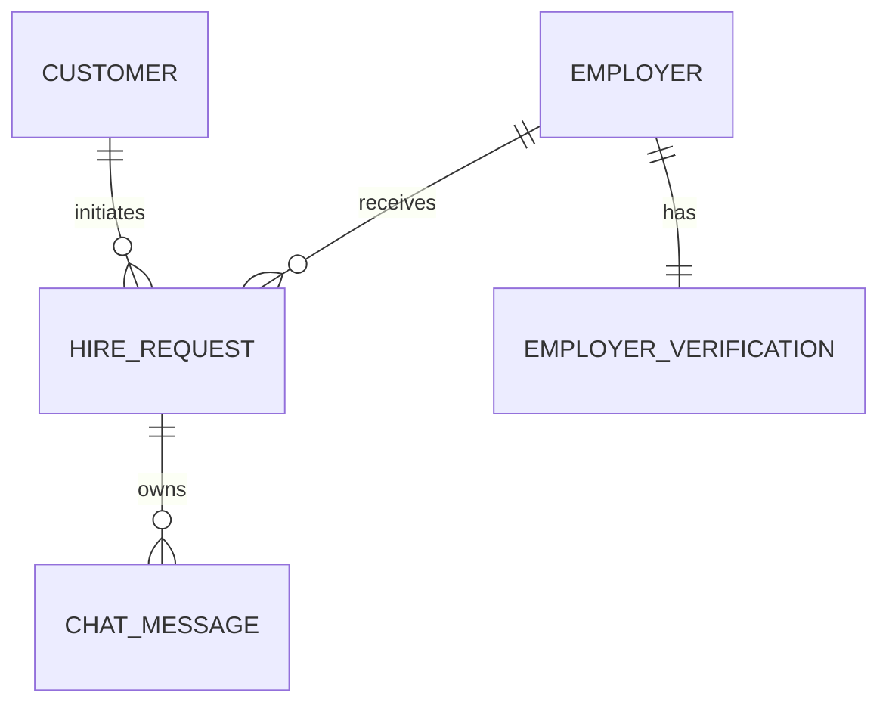

# Blue Connect

Blue Connect is a modern, decoupled web application built to connect local service seekers (Customers) with qualified, verified independent service providers and gig workers (Employers) such as housekeepers, plumbers, carpenters, drivers, masons, and mechanics.

The platform provides a secure environment for customers to locate verified, location-specific service providers, negotiate rates, manage hire bookings, and chat in real-time. By automating the verification audit workflow, Blue Connect ensures service safety, provider reliability, and seamless client-worker matching.

### Core Business Objectives
* **Trust & Safety**: Standardize background verification audits for local gig workers by implementing structured admin approvals.
* **Match Efficiency**: Enable users to search and filter service providers by category, state, and district in real-time.
* **Seamless Engagement**: Facilitate end-to-end booking, status workflows, system alerts, and messaging threads.

### Target Users
1. **Customers**: Seekers looking to hire verified local hands-on help for specific jobs.
2. **Employers**: Independent service providers advertising their skills, experience, and daily rates.
3. **Administrators**: Verification officers who review uploaded KYC files (Aadhaar, PAN, face matches) and manage accounts.

---

## Features

### 1. Customer Module
* **Location-Based Search**: Filter verified service providers by category, state, and district.
* **Detailed Profiles**: Review provider experience, daily rates, and contact details.
* **Hire Requests**: Book gig workers with direct task description payloads.
* **Service Status Tracking**: Monitor request status updates (Pending, Accepted, Rejected, Completed).

### 2. Employer Module
* **Profile Management**: Update category, address, experience, and daily rate fields.
* **KYC Upload Console**: Submit face images, Aadhaar cards, PAN cards, and driving licenses.
* **Booking Pipeline**: Review, accept, or reject incoming hire requests.

### 3. Admin Module
* **Dashboard Stats**: Real-time counts of total customers, total employers, pending audits, and verified users.
* **Verification Audits**: View document files, add compliance notes, and trigger approvals or rejections.
* **Account Deletion**: Soft-delete employer profiles or wipe customer records.

### 4. System Services
* **JWT Authentication**: Secure login sessions with access and refresh tokens.
* **Role-Based Access Control (RBAC)**: Route guards and endpoint validation based on user role (Customer, Employer, Admin).
* **Password Recovery OTP**: Reset credentials via email codes using SendGrid.
* **Interactive Messaging**: Direct text messaging unlocked upon request acceptance.
* **System Alerts**: Instant notification counts for status modifications and verification reviews.
* **OpenTelemetry Observability**: SQL and API request tracing via OpenTelemetry and Jaeger.

---

## Technology Stack

### Backend
* **Framework**: Django REST Framework (DRF) (v6.0.6)
* **API Toolkit**: Django REST Framework views and serializers (v3.17.1)
* **Python Env**: Python v3.12+ (supports v3.14.0)

### Frontend
* **UI Framework**: React (v19.2.0)
* **Build Engine**: Vite (v7.3.1)
* **Design Engine**: Material-UI (MUI v7.3.9)
* **Form Logic**: Formik & Yup (v1.7.1)
* **State Cache**: TanStack React Query (v5.95.2)

### Database & Storage
* **Engine**: PostgreSQL (Production) / SQLite (Dev)
* **Storage**: Local filesystem media storage for uploaded documents.

### Integrations
* **Authentication**: Django REST Framework SimpleJWT (v5.5.1)
* **Email Broker**: SendGrid API Client (v6.12.5)
* **Observability**: OpenTelemetry API / SDK (v1.42.1)

---

## Architecture Overview

```text
┌──────────────────────┐        ┌─────────────────────┐        ┌──────────────────────┐
│  React UI (Vite)     │ ◄────► │  Axios HTTP Client  │ ◄────► │  Django REST API     │
└──────────────────────┘        └─────────────────────┘        └──────────┬───────────┘
                                                                          │
                                                                 (ORM / SQL Queries)
                                                                          ▼
┌──────────────────────┐        ┌─────────────────────┐        ┌──────────────────────┐
│    Media Storage     │ ◄────► │   PostgreSQL DB     │ ◄────► │  OpenTelemetry/OTLP  │
└──────────────────────┘        └─────────────────────┘        └──────────────────────┘
```

1. **Client Interaction**: React pages dispatch user mutations or queries.
2. **Gateway**: Axios interceptor appends JWT access headers: `Authorization: Bearer <token>`.
3. **Application Routing**: Django routing matches patterns and delegates tasks to app views.
4. **Validation & ORM**: View methods pass requests through serializers, query PostgreSQL models, and execute changes.
5. **Observability**: OpenTelemetry instruments requests and database connections, pushing traces to Jaeger at port `4318`.

---

## Folder Structure

```text
blue-connect-feature-login/
├── api/                             # Django Backend Service
│   ├── apps/                        # Django Applications
│   │   ├── adminpanel/              # Admin dashboard data lists and stats
│   │   ├── authentication/          # User login, session, and token refresh
│   │   ├── customer/                # Customer profile creation and fetching
│   │   ├── employer/                # Employer profile details and categories
│   │   ├── hire_request/            # Hire request creations and updates
│   │   ├── messaging/               # In-app chat messaging between users
│   │   ├── notifications/           # Triggers alerts and JWT auth interceptors
│   │   ├── password_reset/          # OTP creation, validation, and email dispatch
│   │   └── verification/            # Documents KYC storage and approval views
│   ├── common/                      # Shared helper utility files
│   │   └── utils/                   # otel_metrics.py, telemetry.py, password_validation.py
│   ├── config/                      # Root configuration (settings.py, urls.py)
│   ├── media/                       # Uploaded identity images
│   └── requirements.txt             # Backend dependencies lists
└── ui/                              # React Frontend Service
    ├── public/                      # Static client files
    ├── src/                         # React UI code
    │   ├── api/                     # Axios instance and base request setup
    │   ├── app/                     # React App entry and client routing mapping
    │   ├── assets/                  # Images, logo and category icons
    │   ├── features/                # Domain-specific components and pages
    │   └── shared/                  # Common navbars, footers, and providers
    └── package.json                 # Node package dependencies
```

---

## Prerequisites

### Supported Operating Systems
* **Windows**: Windows 10, Windows 11 (64-bit).
* **Linux**: Ubuntu 20.04+, Debian 11+, Linux Mint 20+.

### Software Requirements
* **Python**: v3.10.x to v3.14.x
* **Node.js**: v18.x or v20.x (LTS)
* **npm**: v9.x or v10.x
* **PostgreSQL**: v14, v15, or v16
* **Git**: v2.34+
* **Docker Engine & Compose**: Required for containerized runtime.

---

## Version Verification

Run these command lines to verify your local software versions:
```bash
python --version
node -v
npm -v
git --version
psql --version
docker --version
docker compose version
```

---

## Installation

### Option 1: Docker Setup (Recommended for dev/testing only)
Ensure your Docker daemon is active, then run:
```bash
# Build and start services in the background
docker compose up -d

# Verify all containers are running
docker compose ps
```
The application will be accessible at:
* **Frontend Application**: `http://localhost:5173/`
* **Backend API Console**: `http://localhost:8000/api/`

---

### Option 2: Local Development Setup

#### 1. Database Setup
1. Create a PostgreSQL database:
   ```sql
   CREATE DATABASE blue_connect_db;
   ```
2. Set database permissions and credentials matching your `.env` values.

#### 2. Backend Installation & Setup
1. Navigate to the `api/` directory:
   ```bash
   cd api
   ```
2. Initialize and activate a Python virtual environment:
   * **Windows**:
     ```powershell
     python -m venv .venv
     .venv\Scripts\activate.ps1
     ```
   * **Linux/macOS**:
     ```bash
     python3 -m venv .venv
     source .venv/bin/activate
     ```
3. Install Python dependencies:
   ```bash
   pip install -r requirements.txt
   ```
4. Create your `.env` file using the provided template:
   ```bash
   cp .env.example .env
   ```
5. Apply database schemas:
   ```bash
   python manage.py migrate
   ```
6. Create an administrator account:
   ```bash
   python manage.py createsuperuser
   ```
7. Launch the API server:
   ```bash
   python manage.py runserver
   ```

#### 3. Frontend Installation & Setup
1. Navigate to the `ui/` directory:
   ```bash
   cd ../ui
   ```
2. Install npm packages:
   ```bash
   npm install
   ```
3. Run the Vite development server:
   ```bash
   npm run dev
   ```

---

## Environment Variables

Copy `api/.env.example` to `api/.env` and update the values:

* `DB_NAME`: The database name (default: `blue_connect_db`).
* `DB_USER`: Database connection username (default: `postgres`).
* `DB_PASSWORD`: Password for your database user.
* `DB_HOST`: Mapped database host (use `localhost` locally, or `db` inside Docker).
* `DB_PORT`: PostgreSQL port (default: `5432`).
* `SENDGRID_API_KEY`: API key for password reset OTP delivery.
* `FROM_EMAIL`: Sender address verified inside SendGrid console.
* `SECRET_KEY`: (Optional) Custom Django secret key overrides.

---

## Default URLs Reference

* **Frontend App**: `http://localhost:5173/`
* **REST API Endpoint**: `http://localhost:8000/api/`
* **Django Admin Panel**: `http://localhost:8000/admin/`
* **Media Assets Root**: `http://localhost:8000/media/`

---

## Project Structure (Applications Breakdown)

* **`customer`**: Registers customer profiles and handles profile query lookups.
* **`employer`**: Manages skills categories, daily rates, locations, profile details, and worker listings.
* **`adminpanel`**: Compiles dashboard metrics and handles customer account removal.
* **`verification`**: Saves KYC files (Face, Aadhaar, PAN, License) and processes admin approvals/rejections.
* **`messaging`**: Handles thread listings and direct messaging.
* **`hire_request`**: Manages hire requests, updates, and booking logs.
* **`authentication`**: Login handler and JWT token manager.
* **`password_reset`**: Verifies accounts, sends email OTPs, and resets passwords.
* **`notifications`**: Manages real-time alert logs.
* **`common`**: Shared utilities, telemetry hooks, and password complexity check files.
* **`config`**: General Django settings, database configs, and root URL patterns.

---

## API Overview

* **`/api/auth/`**: Core user logins (`/login/`), token refreshes (`/refresh/`), and logout wrappers.
* **`/api/customer/`**: Customer signups and profile retrievals.
* **`/api/employer/`**: Employer registrations, verified provider searches, detailed queries, profile updates, and verification status controls.
* **`/api/verification/`**: KYC uploads and admin approval portals.
* **`/api/hirerequest/`**: Booking request creation, status changes, and statistics tracking.
* **`/api/messages/`**: Direct chat delivery and history lists.
* **`/api/notifications/`**: Real-time notifications for customer and employer dashboards.
* **`/api/passwordreset/`**: Password reset OTP delivery and verification.

---

## Database Architecture



* **Main Models**: `Customer`, `Employer`, `EmployerVerification`, `HireRequest`, `ChatMessage`, `Notification`, and `EmailOTP`.
* **Relationships**:
  * **Employer Verification**: One-to-One relationship linking the `Employer` profile with their `EmployerVerification` files.
  * **Chat Message**: One-to-Many cascading relationship linking `HireRequest` records with `ChatMessage` logs.
  * **Hire Requests**: Non-relational link matching `customer_email` and `employer_email` values.

---

## Authentication & Authorization Flow

### JWT Authentication Flow
1. User enters email and password.
2. Server validates credentials and returns access (15m) and refresh (7d) tokens.
3. Client stores tokens and role type in `localStorage`.
4. Axios interceptors attach tokens to subsequent HTTP headers:
   `Authorization: Bearer <access_token>`

### User Role Permissions
* **Customer**: Can search verified employers, send hire requests, and read customer notifications.
* **Employer**: Can modify rates, upload verification files, and accept/reject bookings.
* **Admin**: Can view verifications, verify/reject employers, delete customers, and view server statistics.

---

## Running the Project Checklist

1. Make sure your database service is active (PostgreSQL status is active).
2. Start the Django backend:
   ```bash
   cd api
   python manage.py runserver
   ```
3. Start the React frontend:
   ```bash
   cd ui
   npm run dev
   ```
4. Log in using test credentials (or create a new account) and start testing.

---

## Testing

* **Backend Tests**: All applications include standard `tests.py` files containing empty Django boilerplate rules. Currently, no automated unit tests are defined.
* **Frontend Tests**: No automated test suites (Jest/Vitest) are configured in `package.json`.
* **Manual Testing Strategy**: Follow the steps in `SETUP_COMPLETE.md` to manually test:
  * Profile registration, OTP recovery, and password updates.
  * Document uploads and admin dashboard verifications.
  * Booking creation, chat activations, and notification updates.

---

## Troubleshooting Guide

* **`401 Unauthorized` / Invalid Tokens**: Stale keys cached in the browser. Clear browser storage (`F12` > Application > Clear Site Data) and reload the page (`Ctrl + F5`).
* **Database Connection Failures**: Make sure the PostgreSQL service is running and that your local database credentials match the `.env` settings.
* **Port Conflicts**: If port `8000` or `5173` is busy, locate the PID using netstat and terminate the process.
* **SendGrid API Faults**: Confirm your SendGrid API key is correct and that `FROM_EMAIL` matches your verified sender address.

---

## Security Policy

* **JWT Routing**: Role scopes are validated in both React routers and Django view permissions.
* **Complexity Validators**: Passwords must contain numbers, symbols, uppercase, and lowercase characters.
* **Exposed Credentials Warning**: Storing secrets in Git repositories is prohibited. Rotate all leaked SendGrid API keys and database passwords before deploying the project.

---

## Production Deployment Checklist

* [ ] Set `DEBUG = False` inside `settings.py`.
* [ ] Configure your deployment domains in `ALLOWED_HOSTS`.
* [ ] Configure `CORS_ALLOWED_ORIGINS` to point strictly to the production frontend domain.
* [ ] Store database secrets and API keys in environment variables on the production server.
* [ ] Set up secure file uploads and database backup schedules.
* [ ] Configure HTTPS/SSL certificates.

---

## Contributing Guide

1. Create a descriptive feature branch off `develop` (e.g. `feature/jwt-fix`).
2. Follow standard coding styles (PEP 8 for Python, ESLint configuration rules for React).
3. Use descriptive commit messages:
   `type(scope): short description` (e.g. `feat(auth): integrate SimpleJWT`).
4. Open a pull request against the `develop` branch.

---

## License

This project is licensed under the MIT License. See [LICENSE](file:///d:/Downloads/blue-connect-feature-login/LICENSE) for details.

---

## Future Roadmap

* **Centralized Auth State**: Manage session states using React Context instead of raw `localStorage` lookups.
* **Backend Security**: Enforce JWT authentication across all views, and restrict admin actions using `IsAdminUser` permissions.
* **Relational Integrity**: Refactor the database schema to replace raw email strings with strict foreign key relationships.
* **Automated Testing**: Implement automated test suites using Vitest (frontend) and Django testing rules (backend).

---

## Acknowledgements

Special thanks to the open-source community for maintaining core dependencies such as Django REST Framework, React, Material-UI, OpenTelemetry, and Vite.
